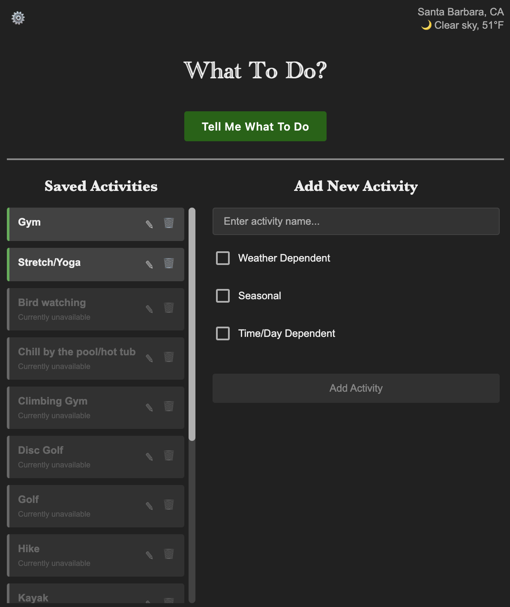

# What To Do (WTD)

A smart activity suggestion app that picks a random activity from your saved activities based on your current weather, season, and time of day.



## 🚀 Getting Started

### Download & Install

#### macOS
1. Download the `.dmg` file from the [latest release](../../releases)
2. Open the `.dmg` file
3. Drag "What To Do" to your Applications folder
4. Launch from Applications or Spotlight
5. Trust the certificate in System Settings
    1. If there is no option to trust in System Settings or you get an error telling you to move the file to the Trash, run the following command in Terminal: `sudo xattr -r -d com.apple.quarantine "/Applications/What To Do.app"`

#### Windows
1. Download the `.exe` installer from the [latest release](../../releases)
2. Run the installer
3. Follow the installation prompts
4. Launch from Start Menu or Desktop shortcut

#### Linux
1. Download the `.AppImage` file from the [latest release](../../releases)
2. Make it executable: `chmod +x What-To-Do-*.AppImage`
3. Run it: `./What-To-Do-*.AppImage`
4. Or install the `.deb` or `.rpm` package if you prefer a native package manager install

### First Time Setup
1. **Location**: The app will try to auto-detect your location. If it fails, click the weather area to set it manually
2. **Add Activities**: Use the right panel to add your favorite activities with their restrictions
3. **Get Suggestions**: Click "Tell Me What To Do" to have one chosen!

### Settings
Click the gear icon (⚙️) to configure:
- **Location**: Change your location or re-detect automatically
- **Time Format**: 12-hour vs 24-hour display
- **Temperature Unit**: Fahrenheit vs Celsius
- **Theme**: Light, Dark, or Auto (follows system)
- **Auto Updates**: One-time opt-in; when enabled the app checks on startup, prompts before download, then prompts to restart and install

## 🛠️ Development

### Prerequisites
- Node.js 18+
- npm

### Setup
```bash
# Clone the repository
git clone <repository-url>
cd wtd-app

# Install dependencies
npm install

# Run in development mode
npm run dev

# Build for distribution
npm run dist
```

### Project Structure
```
wtd-app/
├── main.js              # Electron main process
├── .github/
│   └── workflows/
│       └── build-release.yml  # GitHub Actions build and release pipeline
├── src/
│   ├── index.html       # Main UI
│   ├── script.js        # Application logic
│   └── styles.css       # Styling and themes
├── package.json         # Dependencies and build config
```

### Technologies Used
- **Electron**: Cross-platform desktop app framework
- **Vanilla JavaScript**: No frameworks, pure JS
- **OpenWeatherMap API**: Weather data and geocoding
- **CSS Custom Properties**: Theme system
- **GitHub Actions**: Automated builds and releases

### Releases
Push a git tag to build and publish installers for macOS, Windows, and Linux:

```bash
git tag v1.0.2
git push origin v1.0.2
```

## 🤝 Contributing

1. Fork the repository
2. Create a feature branch (`git checkout -b feature/amazing-feature`)
3. Commit your changes (`git commit -m 'Add amazing feature'`)
4. Push to the branch (`git push origin feature/amazing-feature`)
5. Open a Pull Request

## 📝 License

This project is licensed under the MIT License - see the [LICENSE](LICENSE) file for details.

## 🙏 Acknowledgments

- Weather data provided by [OpenWeatherMap](https://openweathermap.org/)
- Majority coded by [Claude AI](https://claude.ai/)
- Built with ❤️ for people who need help deciding what to do

## 📞 Support

Having issues? Check out the [Issues](../../issues) page or create a new issue with:
- Your operating system
- App version
- Steps to reproduce the problem
- Screenshots if applicable

---

**Enjoy deciding what to do!** 🎉
